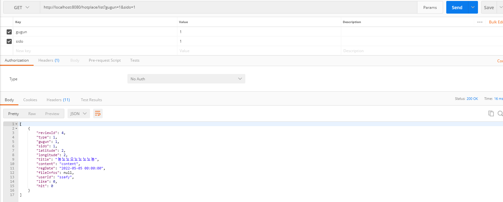
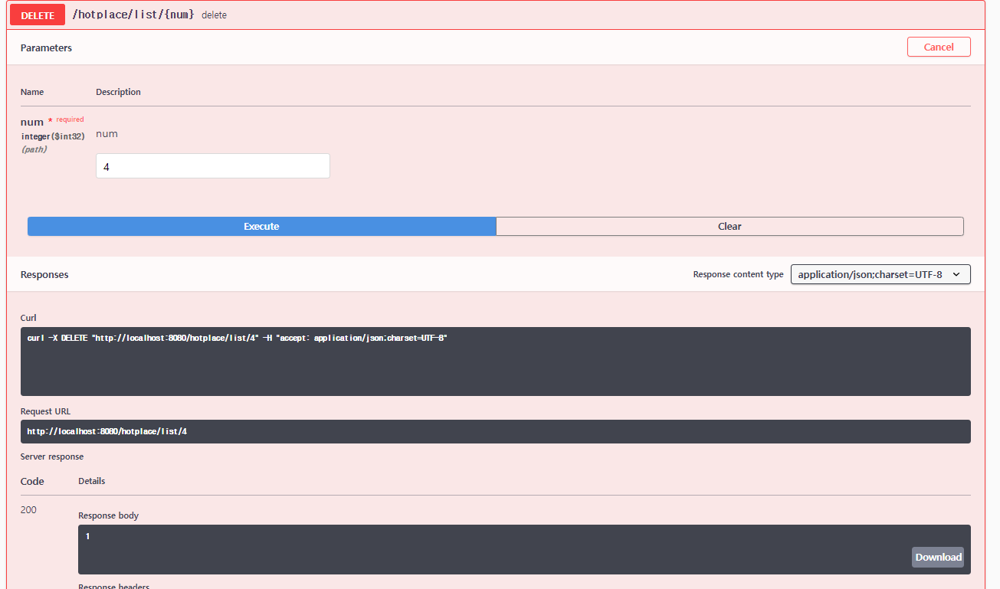
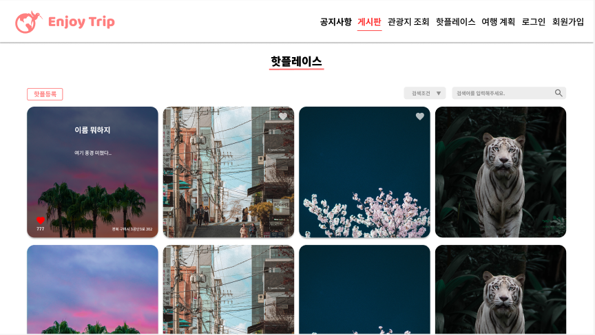
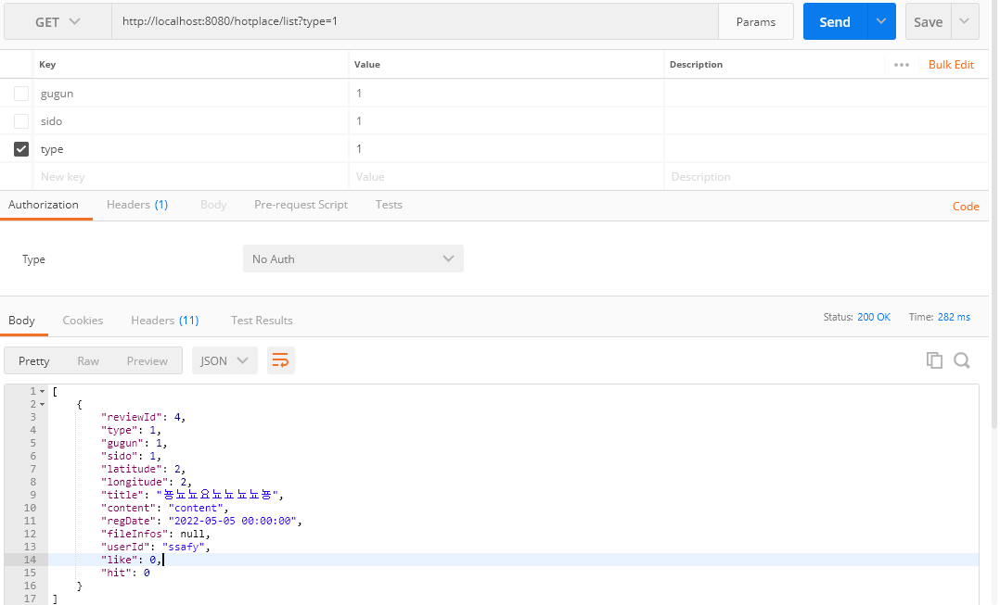
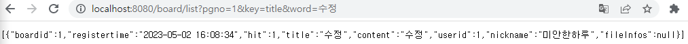
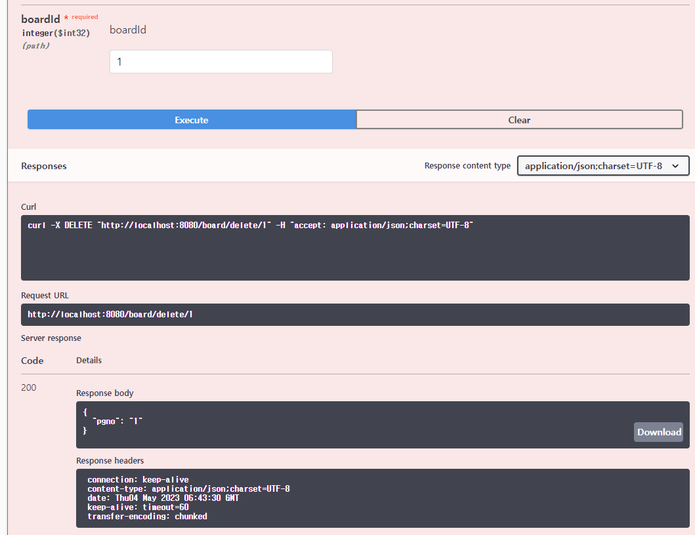
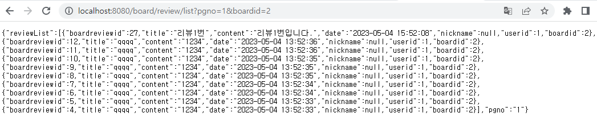
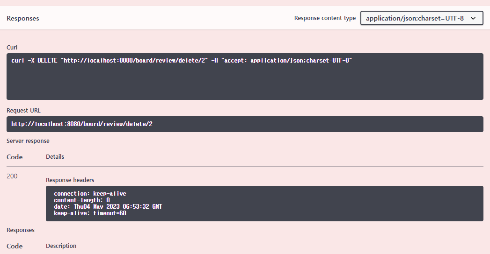

# EnjoyTrip_spring_구미_5반_강준구_송승현

[작업내용]

0. 홈 화면 구상(구상까지만 완료), 지도
	
	
	
    
1. 로그인 : Spring & JPA로 구현함,
	
	
	(화면 구상 완료, 현재 작성 중)
	
2. 회원가입 : Spring & JPA로 구현함
	
3. 회원수정 : Spring & JPA로 구현함
	
	
	(화면 구상 완료, 현재 작성 중)
	
4. 여행계획 : Spring & myBatis로 구현함
	4-1 : 계획작성
		
	4-2: 계획에 대한 댓글 작성
		
	4-3: 여행계획에 대한 전체 list조회 
		
	4-4 :여행 계확에 대한 상세 내용 조회
		
	4-5 : 여행 계획 삭제
		
	4-6 : 여행 계획 수정
		
5. 핫플레이스 등록: Spring & myBatis로 구현함
	5-1 : 핫플레이스 등록
		
	5-2 : 핫플레이스 수정
		
	5-3 : 핫플레이스 삭제
		
	5-4 : 핫플레이스 리스트 조회
		5-4-1 : 전체 조회
			
			
		5-4-2 : 시군구로 조회
			
		5-4-3 : 관광지 타입 별 조회
			
	5-5 : 핫플레이스 상세 조회
		
6. 공지사항 : Spring & myBatis로 구현함
	6-1. 전체기능
		
	6-2. 글 등록
		
	6-3. 글 수정
		
	6-4. 글 삭제
		
	6-5. 리스트 조회
		
	6-6. 글 조회
		
7. 게시글 : Spring & myBatis로 구현함
	7-1. 게시글 조회
		
		
	7-2. 게시글 검색
		
	7-3. 게시글 등록 화면 구상
		
	7-3. 게시글 수정
		
	7-4. 게시글 삭제
		
	7-5. 댓글 보기
		
	7-6. 댓글 등록
		
	7-7. 댓글 수정
		
	7-8. 댓글 삭제
		
	

